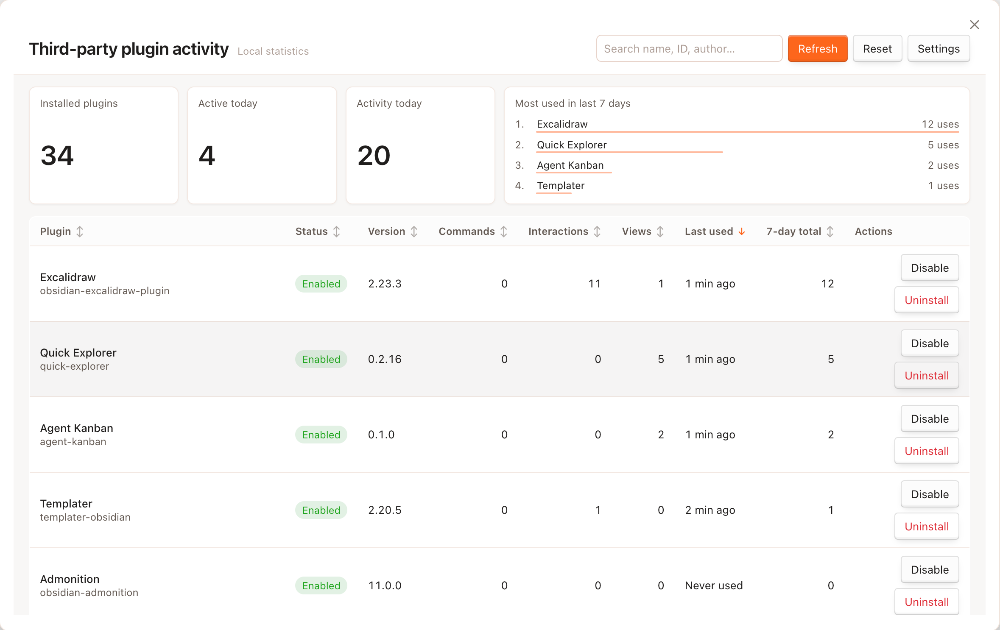

# Plugins Activity

[English](./README.md) | [简体中文](./README.zh-CN.md)

[License: MIT](./LICENSE)

**Plugins Activity** helps you understand how you actually use third-party Obsidian plugins. It records local usage over time and shows everything in one clear overview — so you can see which plugins you rely on, which ones you rarely touch, and which ones might be worth disabling.

All data stays on your device. Nothing is uploaded.

## What it does

- **Tracks third-party plugin usage locally** — See how often you run commands, open plugin views, and interact with supported plugins.
- **Shows a full overview in one place** — Browse all installed third-party plugins with search, sorting, and summary stats.
- **Highlights recent activity** — Check last used time and 7-day totals for each plugin.
- **Keeps a daily history** — Usage is grouped by day, with older data cleaned up automatically based on your preference.
- **Lists plugin details** — View plugin name, version, author, and whether it is currently enabled.
- **Explains untrackable plugins** — Some passive plugins cannot be measured reliably; the overview tells you when that happens.
- **Respects your privacy** — Statistics are stored only inside your vault.

## How to open the overview

| Entry point     | Action                               |
| --------------- | ------------------------------------ |
| Command palette | **Open plugin usage overview**       |
| Ribbon          | Click the bar chart icon             |
| Settings        | Turn on **Open overview on startup** |

Inside the overview, you can search plugins, sort the table, refresh the list, or clear all collected statistics.

## Settings

Find these under **Settings → Plugins Activity**:

| Setting                  | What it does                                                  |
| ------------------------ | ------------------------------------------------------------- |
| Enable tracking          | Turn usage recording on or off                                |
| Retention days           | Remove daily records older than the number of days you choose |
| Show disabled plugins    | Include disabled third-party plugins in the overview          |
| Open overview on startup | Automatically open the overview when Obsidian starts          |
| Reset all statistics     | Delete all stored usage data                                  |

## Privacy

- All statistics are saved locally in your vault.
- No analytics or telemetry are sent anywhere.
- You can pause tracking or delete all data at any time.

## License

[MIT](./LICENSE)