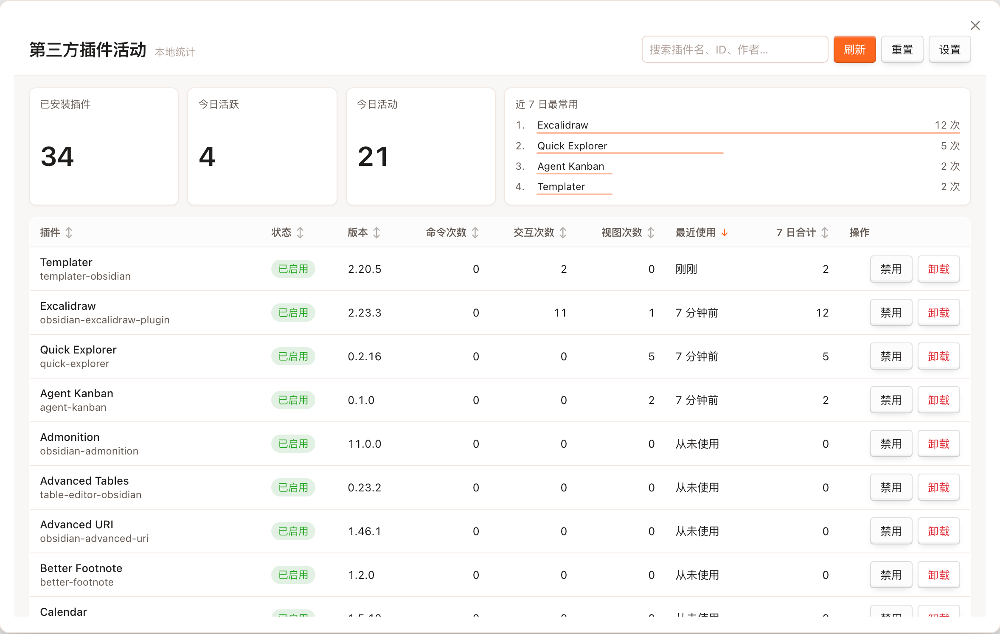

# Extensions-Activity

[English](./README.md) | [简体中文](./README.zh-CN.md)

[License: MIT](./LICENSE)

**Extensions-Activity** 帮你了解自己在实际工作中如何使用第三方社区扩展。它会在本地记录使用情况，并在一个清晰的总览页中展示——让你知道哪些插件是日常刚需、哪些很少打开、哪些可以考虑停用。

所有数据只保存在本地，不会上传。

## 它能做什么

- **本地统计第三方插件使用情况** — 记录命令执行、视图打开，以及受支持插件的交互次数。
- **一页看清全部插件** — 集中浏览已安装的第三方插件，支持搜索、排序和汇总信息。
- **关注近期活跃度** — 查看每个插件的最近使用时间和 7 日合计。
- **展示插件更新状态** — 汇总 Obsidian 自己的社区插件更新检查结果，并跳转到官方更新页。
- **保留按日历史** — 使用数据按天汇总，并会根据你的设置自动清理过期记录。
- **展示插件信息** — 显示插件名称、版本、作者，以及当前是否启用。
- **提示无法统计的插件** — 部分被动生效的插件难以准确统计，总览页会明确标注。
- **保护隐私** — 统计数据仅保存在你的 vault 中。

## 如何打开总览页

| 入口   | 操作              |
| ---- | --------------- |
| 命令面板 | **打开插件使用总览**    |
| 功能区  | 点击柱状图图标         |
| 设置   | 开启 **启动时打开总览页** |

在总览页中，你可以搜索插件、排序表格、刷新列表，或清空全部统计数据。

## 设置项

位于 **设置 → Extensions-Activity**：

| 设置       | 作用                   |
| -------- | -------------------- |
| 启用使用统计   | 开启或关闭使用记录            |
| 排除渲染类活动 | 不把 Markdown 渲染处理器计入插件活动 |
| 数据保留天数   | 自动清理超过指定天数的日统计       |
| 显示已禁用插件  | 是否在总览页显示已禁用的第三方插件    |
| 启动时打开总览页 | Obsidian 启动后是否自动打开总览 |
| 清空全部统计数据 | 删除所有已保存的使用数据         |

## 隐私说明

- 所有统计数据仅保存在 vault 本地。
- 不会发送任何分析或遥测数据。
- 更新检查使用 Obsidian 现有的社区插件更新机制。
- 你可以随时暂停统计，或一键清空全部数据。

## 许可证

[MIT](./LICENSE)
